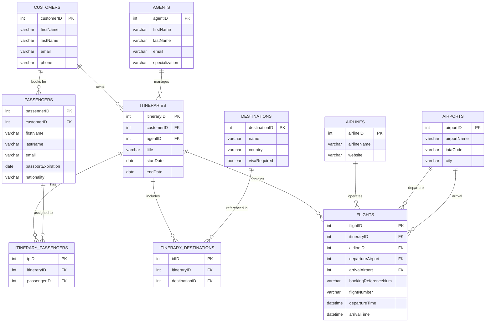

# ✈️ World Tour 180 

**A full-stack travel management application** built with Node.js, Express, React, and MySQL for tracking complex travel itineraries with multiple stakeholders.

## 🌟 Key Features
- **Multi-role system** (Travelers, Agents)
- **End-to-end itinerary management** from booking to completion
- **Document management** for tickets and visas

## 🧩 Entity Relationship Diagram


## 🛠️ Tech Stack
| Layer | Technology |
|-------|------------|
| **Frontend** | React 18, CSS |
| **Backend** | Express 4 |
| **Database** | MySQL |

## 🗃️ Core Entities
1. **People** (Base user entity)
2. **Passengers** (Travelers with passport details)
3. **Agents** (Travel professionals managing trips)
4. **Flights** (Individual flight segments)
5. **Itineraries** (Complete travel plans)
6. **Destinations** (Cities/Countries with attractions)
7. **Airports** (IATA codes, terminals, gates)
8. **Airlines** (Carriers with contact info)

## 🚀 Getting Started

### Prerequisites
- MySQL 8+ (`brew install mysql`)

### Installation
```bash
# 1. Clone repo
git clone https://github.com/earthlydev/World-Tour-180.git

# 2. Set up database (requires MySQL credentials)
mysql -u root -p < database/init.sql

# 3. Install dependencies
npm run setup-all  # Runs concurrent client/server installs

# 4. Configure environment
cp .env.example .env
# Edit with your credentials
```

### Running the App
```bash
# Start in development mode (2 terminal sessions)
npm run dev:server  # Backend on :5000
npm run dev:client  # Frontend on :3000
```

## 🔍 Agent-Specific Features
- **Commission tracking** per booking
- **Document expiration alerts**

## 🤝 Team Collaboration
We use:
- **GitHub Projects** for task tracking
- **Microsoft Teams** for daily standups
- **Conventional commits** for version control
The README now better reflects:
- The professional nature of a travel management system
- The role of agents in the workflow
- Clear technical requirements
- Team development practices
